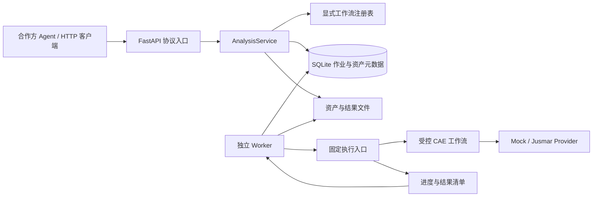

# 系统架构与技术方案

状态：应用 0.2.0，当前实现为可运行的工作流 Mock；真实 GUI / SDK 接入仍待验证。

## 1. 定位与边界

本系统将团队维护的 CAE 自动化流程封装为可发现、可校验、可执行、可追踪的业务能力。合作方 Agent 负责理解用户需求、补齐信息和调用协议；中台负责固定业务流程、参数校验、任务状态、底层执行与结果交付。

中台不实现合作方的 Prompt、Planning 或 Memory。工作流中的确定性顺序和 SDK 调用规则属于 CAE 领域执行逻辑，由中台维护。

当前发布的主能力是 `modal_analysis@1.0`：一个几何资产、自由边界、单一各向同性线弹性材料、全部实体统一赋材、一阶四面体网格和 Lanczos 模态设置。材料物性与几何长度单位必须显式传入。

当前没有真实 CAD 解析、真实网格或真实物理求解。所有返回都标记 `execution_mode=mock`；成功仅表示自动化协议及 Mock 执行闭环成功。

## 2. 总体结构



当前 Worker 固定启动隔离的 Mock Python 入口。真实模式将由同一位置启动经过验证的 `guierunner` 入口，再由该运行环境调用 `jusmar_app`。FastAPI 不直接导入真实 SDK，也不接受客户传来的脚本、命令行或入口路径。

## 3. 业务工作流

客户提交完整分析请求，而不是逐个调用九个底层操作。当前模态分析在一次受控运行中完成：

```text
导入几何 → 生成网格 → 新建材料 → 新建三维属性 → 添加工况
→ 求解设置 → 工况设置 → 后处理设置 → 提交求解
→ 跟踪求解 → 收集结果
```

前九步复用给定的模拟 SDK 能力；后三步确保“提交求解”不被误认为“已得到分析结果”。`succeeded` 需要全部 11 步完成、入口进程正常结束、结构化结果与输入快照相符、结果文件校验通过。

中间 `project_id`、`material_id`、`load_case_id` 和底层 `solver_task_id` 由工作流内部传递。合作方 Agent 主要管理 `asset_id`、`run_id`、幂等键及自己的会话状态。

## 4. 对外协议策略

共享能力包括资产上传、流程目录、预检、提交、运行查询、取消和结果读取。每种 CAE 分析仍使用独立的、类型明确的 Pydantic 请求和结果模型；不以不受约束的 `dict` 代替业务契约。

工作流 ID 与版本标识客户可见的输入输出语义；实现版本固定实际执行代码。SDK 参数改名或内部拆分通常只影响映射层；单位、赋材范围、载荷定义、边界条件或结果含义改变时，需要评估客户协议版本升级。

OpenAPI / JSON Schema 用于 REST 契约描述。未来 MCP 工具应复用同一个业务服务和模型，例如类型化提交工具加通用运行查询工具；REST `operationId` 本身不等于 MCP 服务已经存在。

## 5. 代码职责

| 位置 | 职责 |
| --- | --- |
| `app/api/v1/analysis.py` | REST、身份依赖、参数绑定和响应 |
| `app/schemas/analysis.py` | 工作流输入、状态、结果和文件模型 |
| `app/services/analysis_service.py` | 资产、预检、提交、幂等及结果读取 |
| `app/workflows/registry.py` | 工作流、版本、Schema、步骤和函数的显式登记 |
| `app/workflows/modal.py` | 模态步骤、内部引用传递、结果语义检查 |
| `app/storage/jobs.py` | 持久化、事务、领取、租约和状态转换 |
| `app/execution/worker.py` | 独立任务循环、暂存、子进程、超时与回执验证 |
| `app/execution/protocol.py` | Runner 输入、进度、结果文件协议 |
| `app/providers/` | 模拟 Provider 与未来 SDK 适配边界 |

旧九接口代码默认不挂载，仅作为底层能力回归和内部参考；其内存工程状态不能与持久化工作流交换 ID。

## 6. 异步、持久化与状态

API 使用异步数据库和文件 I/O；Worker 使用 `asyncio.create_subprocess_exec` 通过参数数组启动固定入口，不拼接 Shell 命令。真实 SDK 的线程、GUI 主线程与会话要求需要实测，不能仅靠 `async def` 或普通线程池解决。

`assets` 记录调用方、受控物理路径和资产元数据。`analysis_runs` 记录调用方、幂等键、请求摘要、输入快照、状态、尝试 ID、租约和公开运行视图。写入使用短事务，当前一个数据库最多一个活动执行槽位。

`queued → running → succeeded / failed / cancelled / timed_out` 是可确认路径。租约失效、Worker 中断或外部执行情况不明时进入 `unknown`，隔离执行槽位，不自动重放。该设计约束状态发布权，不能承诺外部 GUI 副作用“恰好一次”。

## 7. 工业化边界与演进

当前 SQLite 方案适用于单主机、一个执行槽位的 Mock 验证，不适合共享网络盘或多主机 GUI 调度。跨主机时需引入集中数据库、资产分发、Worker 能力登记、桌面会话与许可证管理。

首个真实流程优先在一次 Runner 生命周期内完成。若将来需要“生成网格后查看质量，再由 Agent 决定下一步”，应单独设计分阶段运行或工程会话的持久定位、修改锁、超时和恢复协议。

计算过程与作业分离可参考 [OGC API Processes](https://docs.ogc.org/is/18-062r2/18-062r2.html)。它是设计参考，不代表本项目已声明符合其全部规范。
